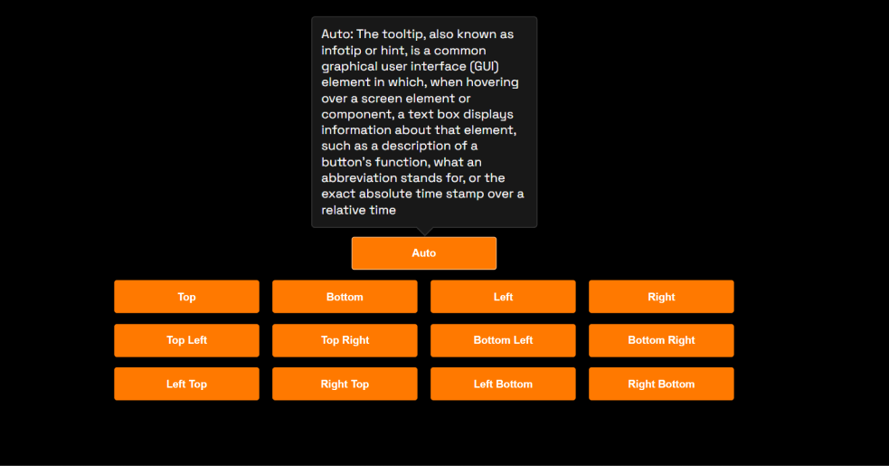

# **Ultimate Tooltip**

## **CDN**

Include in project.

```html
<link
  rel="stylesheet"
  href="https://cdn.jsdelivr.net/gh/hicodersofficial/tooltip@main/lib/tooltip.css"
/>
<script src="https://cdn.jsdelivr.net/gh/hicodersofficial/tooltip@main/lib/tooltip.js"></script>
```

### Minified

```html
<link
  rel="stylesheet"
  href="https://cdn.jsdelivr.net/gh/hicodersofficial/tooltip@main/lib/tooltip.min.css"
/>
<script src="https://cdn.jsdelivr.net/gh/hicodersofficial/tooltip@main/lib/tooltip.min.js"></script>
```

## Data Property

Use these data property to modify tooltip.

| Property              |   value    | Description            |
| --------------------- | :--------: | ---------------------- |
| data-ttp-off          | true \| "" | Turn off tooltip       |
| data-ttp-opacity      |    0-1     | Set tooltip opacity    |
| data-ttp-class        | CSS class  | Add your own css class |
| data-ttp-triangle-off | true \| "" | Remove tip triangle    |
| data-ttp-margin       |   Number   | Set tooltip margin     |
| data-ttp-placement    | Placements | Set tooltip placement  |

Placement:

```
top
left
bottom
right
top-left
top-right
bottom-left
bottom-right
left-top
left-bottom
right-top
right-bottom
```

## CSS Variable

```css
--ttp-delay: 0.1s;
--ttp-transition-timing: 0.5s;
--ttp-background: #181818;
--ttp-color: #fff;
--ttp-padding: 10px;
--ttp-font-size: 14px;
--ttp-border-radius: 4px;
--ttp-max-width: 250px;
--ttp-border: 1px solid #333;
```

Use above CSS variables to give global or custom class base styling.

Note: ttp-class should not use the padding property; instead, use the --ttp-padding CSS variable to give padding.

## Preview


